# Flow Cytometry NNPlot Layout Automator
(流式細胞術圖表自動排版工具)


## 📖 專案簡介 (Overview)
**開發時間：2023 年**

本專案針對高維度流式細胞術 (High-dimensional Flow Cytometry) 分析流程中，最耗時的 **NxN Plots (nnplot)** 排版工作，開發了一套自動化解決方案。

在檢視 30 色以上 (e.g., 36-color panel) 的螢光補償 (Compensation) 時，研究人員需將數百張散佈圖貼入 PowerPoint。傳統人工排版極度耗時，且難以確保矩陣對齊的精準度。本工具透過 VBA 自動識別頁面圖片數量，一鍵完成標準化排版。

### 🌟 關鍵效益 (Key Impact)
> **"Turning Days into Minutes"**

* **Before (人工排版):** 每處理一個完整的染色圖片 NNPlot 版本，需花費一名研究人員 **1 ~ 3 個工作天**。
* **After (自動化工具):** 使用本工具，**10 分鐘內** 即可完成所有排版工作。
* **Result:** 效率提升超過 **100 倍**，大幅釋放研究人員時間以專注於數據解讀。

---

## 🛠️ 適用情境 (Features)
程式會自動偵測每頁 PPT 內的圖片數量，區分兩種情境並執行不同排版邏輯：

### 情境一：Summary View (1文字 + 3圖)
針對包含「一個文字方塊、一張長方形圖、兩張正方形圖」的頁面。
* **邏輯**：長方形置頂，正方形並列於下方，標題文字自動置中。
* **效果**：增加畫面和諧度，避免文字與圖形重疊。

| Before | After |
| :---: | :---: |
|  | 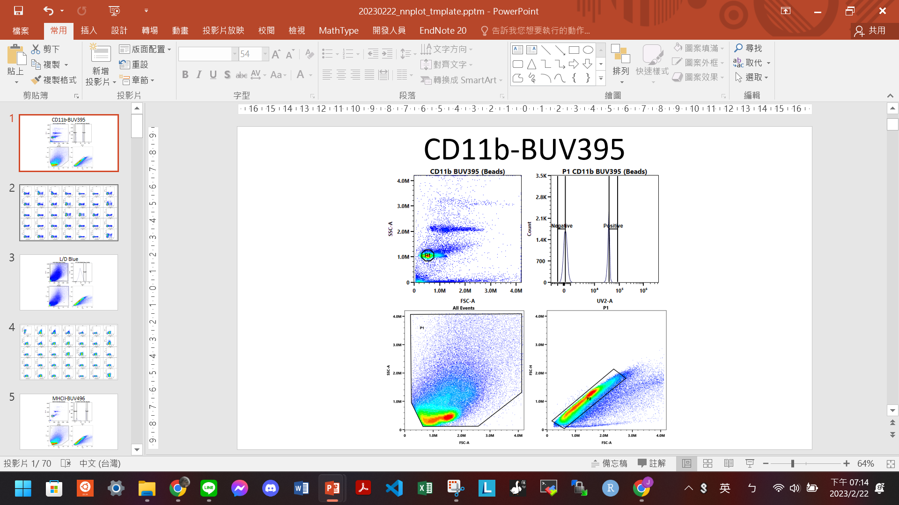 |

### 情境二：Matrix View (35張圖以上)
針對 36-color panel 常見的矩陣檢查頁面。
* **邏輯**：將所有相同形狀的圖片，自動排列為 **5列 x 7行 (5x7 Grid)**。
* **注意**：程式排版後，使用者僅需檢查 Marker 順序是否符合預期 (預設 AF-A 位於右下角)。

| Before | After |
| :---: | :---: |
| 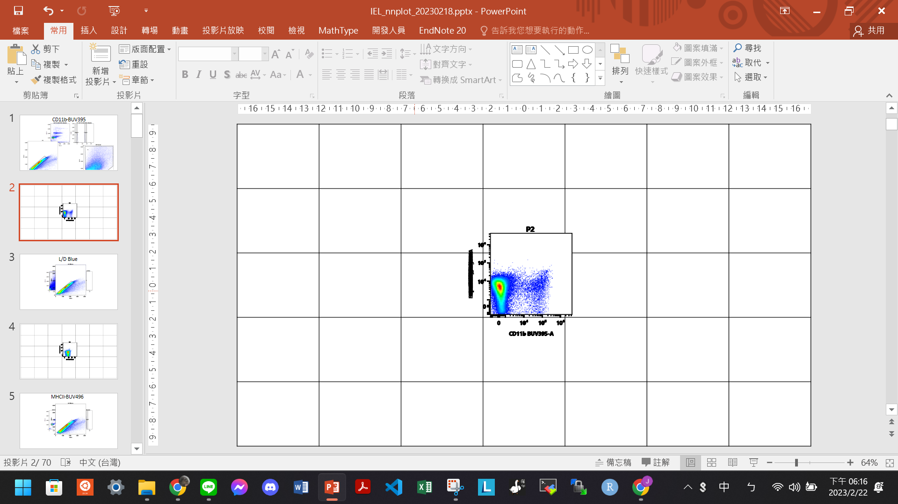 | 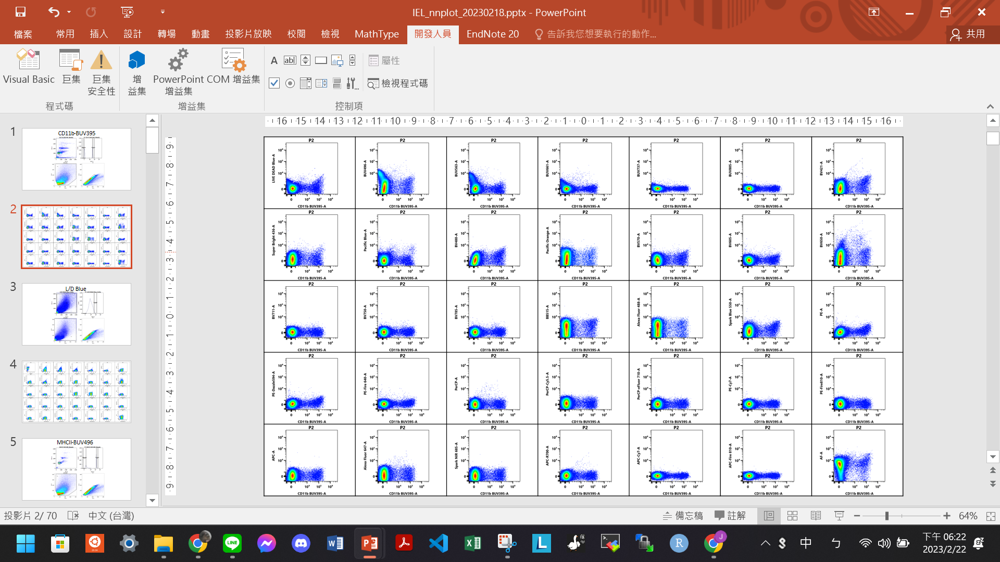 |

---

## 🚀 使用教學 (User Guide)

### 準備工作：下載工具箱
請下載本專案中的巨集檔案： [📥 20230706_nnplot_functions.pptm](./20230706_nnplot_functions.pptm)
*(這是一個包含巨集的 PPT，請把它想像成一個外掛工具箱，只要開啟它，功能就能套用到你其他的 PPT 上)*

### Step 1. 開啟開發人員選項與 VBA
*(每台電腦只需要做一次，若已開啟可跳過)*

1.  開啟 PowerPoint，點選 **[檔案]** → **[選項]**。
    
    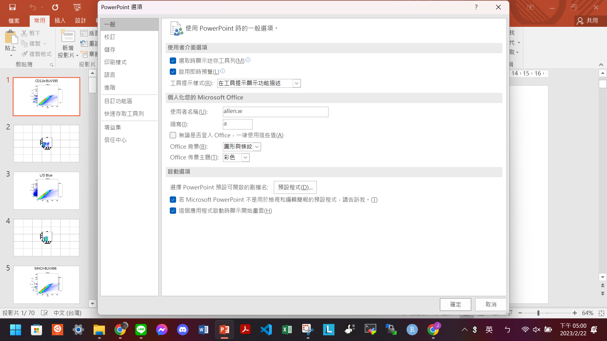

2.  選擇 **[自訂功能區]**，在右側勾選 **[開發人員]**，按下確定。
    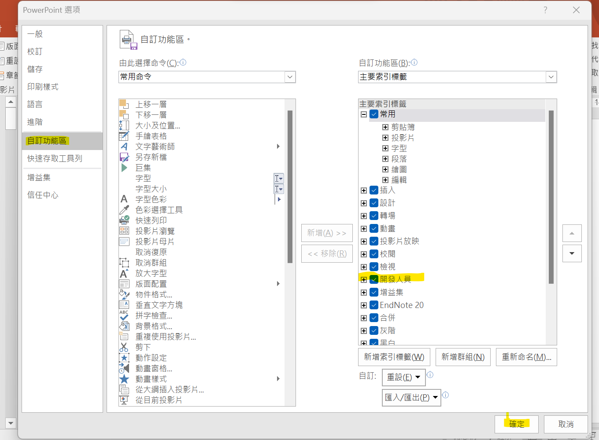

3.  前往 **[信任中心]** → **[信任中心設定]** → **[巨集設定]**。
    勾選 **[啟用所有巨集]** 與 **[信任存取 VBA 專案物件模型]**，按下確定。
    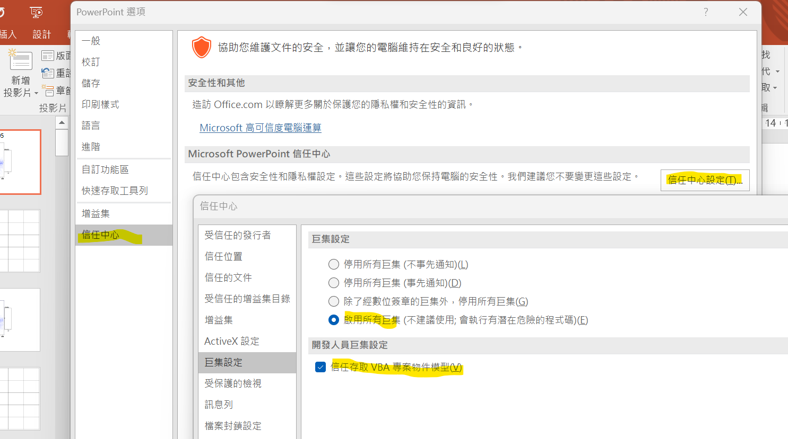

### Step 2. 開始執行自動化排版

1.  **同時打開兩個檔案**：你要排列的數據 PPT (例如 `Data.pptx`) 以及工具箱 (`.pptm`)。
    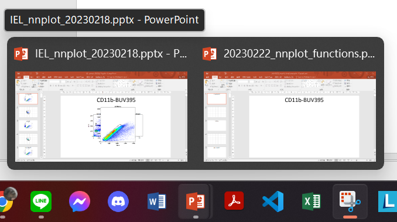

2.  在你要排列的檔案裡，點選上方選單 **[開發人員]** → **[Visual Basic]**。
    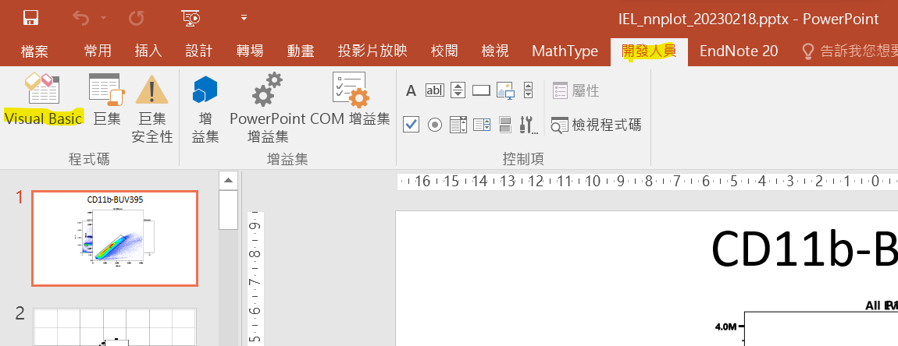

3.  畫面左側會看到工具箱 (`nnplot_functions`) 與你的檔案。
    * `nnplot`: 執行自動排版。
    * `DeleteAllPictures`: 刪除所有圖片 (小心使用)。
    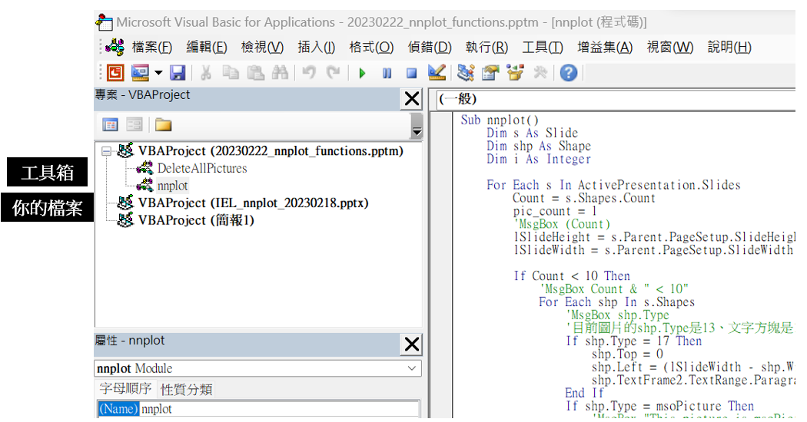

4.  **執行程式**：滑鼠點兩下 `nnplot` 模組，確認右側視窗標題相符，按下上方 **綠色箭頭** (或按 F5) 執行。
    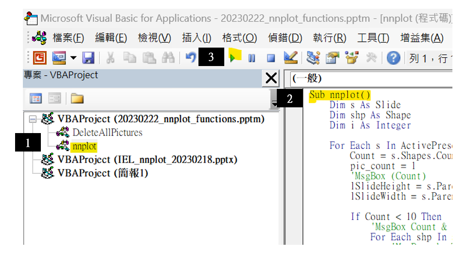

    *(若出現選擇視窗，選擇 nnplot 並執行即可)*
    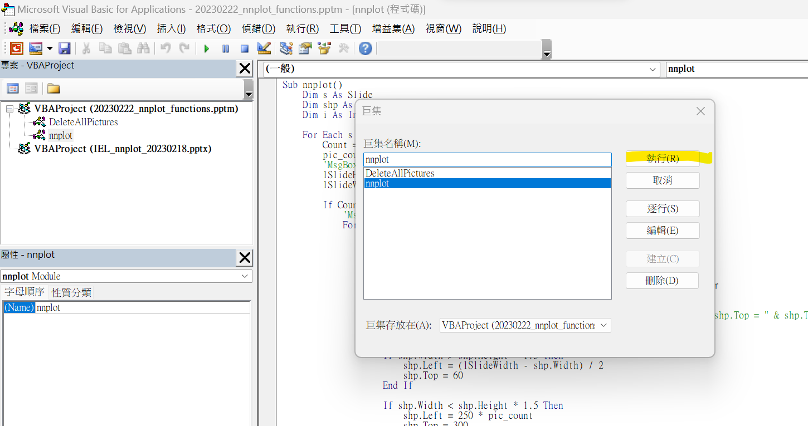

    > **💡 Tip:** VBA 的執行視為一次動作。如果不滿意結果，按一次 `Ctrl+Z` 即可瞬間復原。實測 70 頁 PPT 可在 2 秒內完成。

5.  **完成！** 檢查一下 Marker 順序就可以交報告囉。
    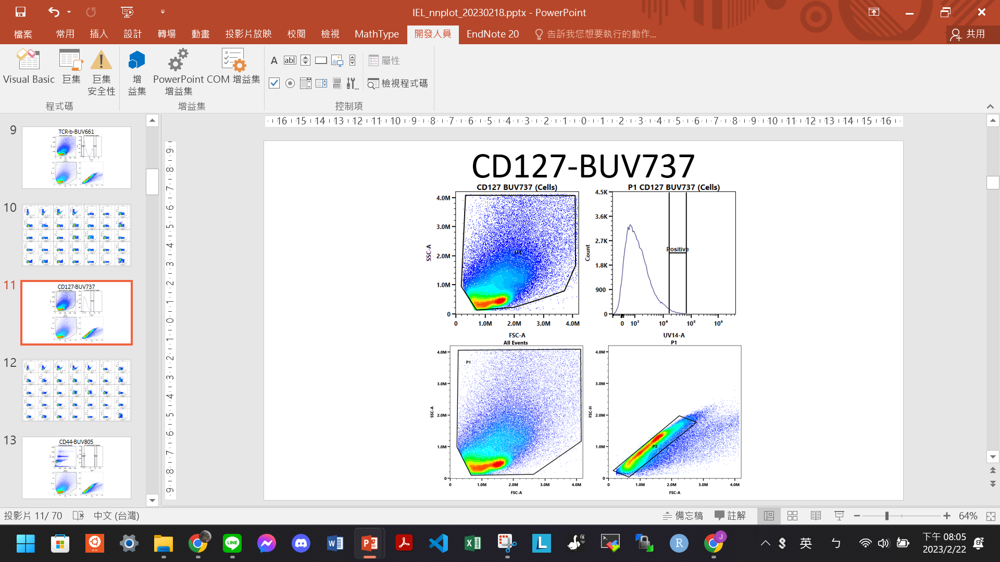

---

## 📂 專案結構
```text
Flow-Cytometry-NNPlot-Automator/
├── docs/
│   └── images/               # 教學截圖
├── src/
│   └── NNPlot_Module.bas     # VBA 原始碼 (匯出供檢閱)
├── 20230706_nnplot_functions.pptm  # 工具箱執行檔
└── README.md
